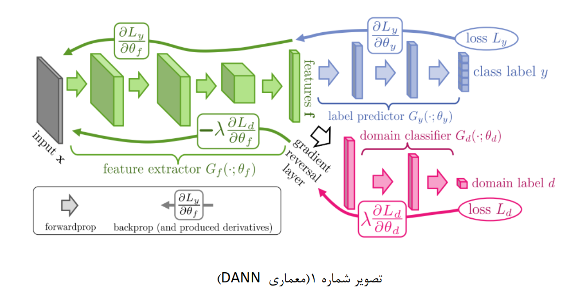
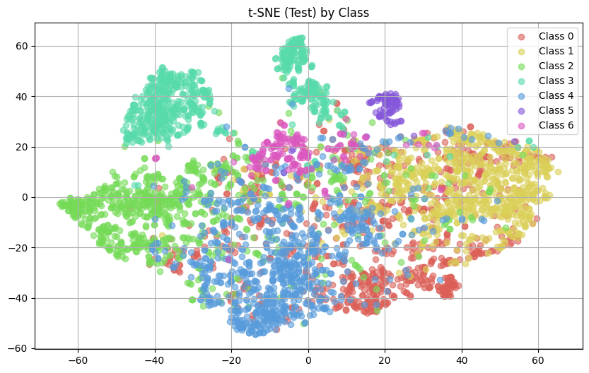
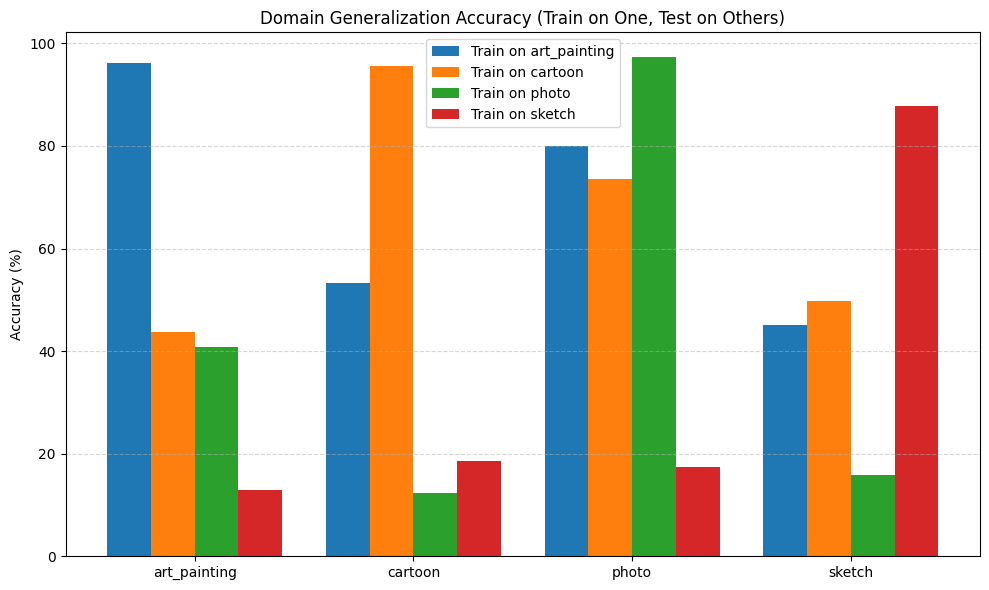
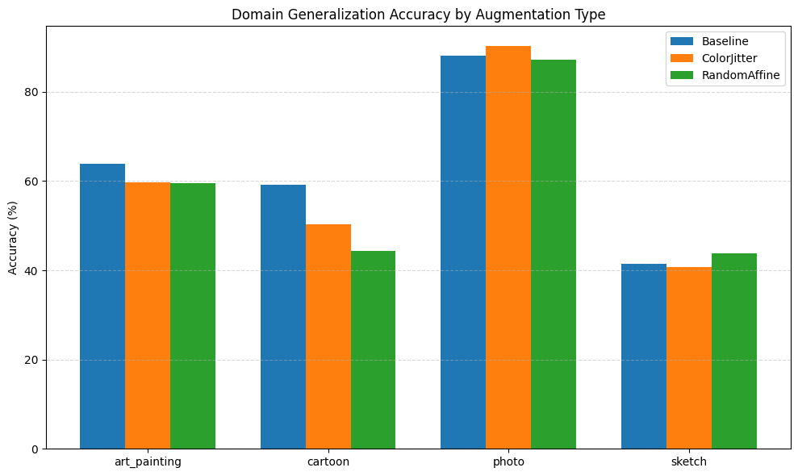

[README.md](https://github.com/user-attachments/files/33003700/README.md)
# Domain Adaptation using DANN

This repository contains the implementation for the first part of the "Trustworthy AI" project. In this section, we tackle the challenge of Domain Shift by employing Domain-Adversarial Training of Neural Networks (DANN) to improve model performance on unseen target domains.

## Project Objectives
- Evaluate Transfer Learning using a pre-trained ResNet18 model.
- Investigate the impact of Data Augmentation on model generalization.
- Implement the Gradient Reversal Layer (GRL).
- Build and train the DANN architecture to extract Domain-Invariant Features.



## Dataset
This project uses the **PACS** dataset, which consists of four distinct image domains:
1. `art_painting`
2. `cartoon`
3. `photo`
4. `sketch`


For detailed information on how to set up the data, please refer to the `data/README.md` file.

## Key Results
The implementation of the DANN network demonstrated that adversarial learning successfully reduces the model's reliance on the source domain. 

- **Accuracy on Sketch domain (without DANN):** ~19.95%
- **Accuracy on Sketch domain (with DANN):** Improved significantly to ~63.02%

### Visualizing Domain Invariance
The t-SNE plots below clearly illustrate how the features extracted from the source and target domains blend together and become indistinguishable after DANN training, compared to standard training.



### Additional Experiments
We also analyzed the baseline generalization accuracy and the specific impact of augmentations like ColorJitter and RandomAffine:




## Repository Structure
```text
.
├── assets/                     # Images, charts, and t-SNE outputs
├── data/                       # PACS dataset directory
│   └── README.md               # Dataset documentation
├── notebooks/
│   └── Q1_Domain_Adaptation_DANN.ipynb  # Main Jupyter notebook
├── README.md                   # This file
└── requirements.txt            # Python dependencies
```

## How to Run
1. Create a Python virtual environment (Python 3.8+ recommended).
2. Install the required libraries:
   ```bash
   pip install -r requirements.txt
   ```
3. Place the PACS dataset inside the `data` folder according to the instructions in `data/README.md`.
4. Open the notebook in the `notebooks` folder using Jupyter and run the cells sequentially.
